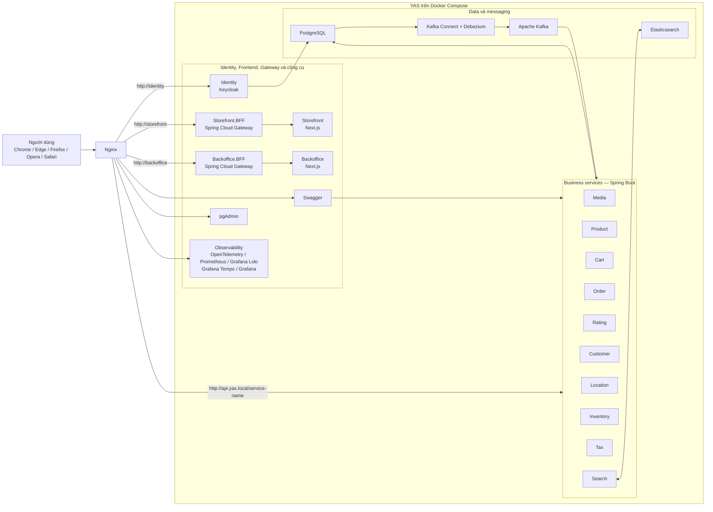
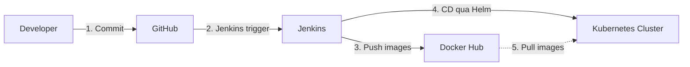
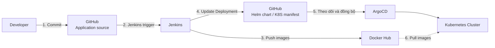

# Đồ án 2: Xây dựng hệ thống CD

## I. Mô tả

Trong môn học này các bạn được yêu cầu xây dựng một quy trình, hệ thống CI/CD và monitor để có thể deploy, vận hành và giám sát được hệ thống **"YAS: Yet Another Shop"** từ link sau:

- Repository: <https://github.com/nashtech-garage/yas>

YAS là một dự án cá nhân nhằm mục đích thực hành xây dựng một ứng dụng microservice điển hình bằng Java.

### Kiến trúc hệ thống YAS

<!-- Sơ đồ dưới đây được tái dựng từ hình minh hoạ trong tài liệu gốc -->


**Mô tả kiến trúc:**

- Người dùng truy cập hệ thống qua trình duyệt, request đi qua **Nginx**.
- **Identity** được triển khai bằng **Keycloak**.
- Hai lớp BFF gồm **Storefront.BFF** và **Backoffice.BFF**, đều dùng **Spring Cloud Gateway**; frontend tương ứng sử dụng **Next.js**.
- Các business service dùng **Spring Boot**: `Media`, `Product`, `Cart`, `Order`, `Rating`, `Customer`, `Location`, `Inventory`, `Tax`, `Search`.
- Hạ tầng liên quan gồm **PostgreSQL**, **Kafka Connect + Debezium**, **Apache Kafka** và **Elasticsearch**.
- Công cụ hỗ trợ và quan sát gồm **Swagger**, **pgAdmin**, **OpenTelemetry**, **Prometheus**, **Grafana Loki**, **Grafana Tempo** và **Grafana**.
- Toàn bộ kiến trúc được đặt trong môi trường **Docker Compose**.

### Các công nghệ và framework

- Java 21
- Spring Boot 3.2
- Testcontainers
- Next.js
- Keycloak
- Kafka
- Elasticsearch
- K8s
- GitHub Actions
- SonarCloud
- OpenTelemetry
- Grafana, Loki, Prometheus, Tempo

---

## II. Yêu cầu

Đây là đồ án 1 trong chuỗi đồ án môn học DevOps, trong đồ án này các bạn cần sử dụng **Jenkins/GitHub Actions/...** để xây dựng pipeline cho quá trình **CD** với những yêu cầu cụ thể sau **(6đ)**.

### Minh họa quy trình CI/CD

<!-- Sơ đồ dưới đây được tái dựng từ hình minh hoạ trong tài liệu gốc -->


**Luồng:**

1. Developer **commit** code lên GitHub.
2. GitHub kích hoạt **Jenkins trigger**.
3. Jenkins build và **push images** lên **Docker Hub**.
4. Jenkins thực hiện bước **CD** thông qua **Helm** để triển khai lên Kubernetes.
5. Kubernetes **pull images** từ Docker Hub để chạy ứng dụng.

### Yêu cầu bắt buộc

1. Mặc định, các bạn sẽ có **1 image cho tất cả các service** với tag là `main` hoặc `latest`; bạn **không cần triển khai Grafana và Prometheus (Observability)** trong đồ án này.

2. Xây dựng **K8S cluster** với **1 Master node** và **1 Worker node**; hoặc sử dụng **Minikube**, hoặc bất kỳ mô hình K8S nào.

3. Phần **CI**: với mỗi branch của user tạo, sau khi user commit code thay đổi, bạn phải build ra một image với tag là **commit id cuối cùng của branch đó**, và push image đó lên **Docker Hub**.

4. Tạo **Job CD** cho developer làm việc với tên `developer_build`. Với job này developer có thể input parameter là branch muốn deploy.

   **Ví dụ:**

   Developer đang làm việc ở branch `dev_tax_service` và update code trong service này. Developer cần biết được sau khi sửa code thì muốn test thử. Lúc này developer sẽ vào job `developer_build` để điền phần parameter `tax-service` là `dev_tax_service`, còn các branch còn lại là `main`.

   Khi đó bạn sẽ deploy code của tất cả các service còn lại theo default là tag `main` hoặc `latest`, còn `dev_tax_service` sẽ là image với tag ở mục 3.

   Sau khi deploy, bạn cung cấp `domain name:port` — dạng service là **NodePort** — để developer có thể truy cập và test code của mình trực tiếp. Phần domain name, do không có DNS, vì vậy developer sẽ tự thêm vào file `hosts` của mình trên máy để chỉ đến **Worker node** của K8S cluster.

5. Tạo **Jenkins job** để xóa phần triển khai ở mục 4.

   - Tham khảo: <https://community.jenkins.io/t/how-to-add-hyperlink-using-jenkins-job-builder/7091>

6. **Bỏ qua phần này nếu làm phần Nâng Cao:** Tương tự, trên Jenkins tạo ra 2 job CI/CD để deploy `dev` và `staging`.

   a. Khi `main` thay đổi, hệ thống tự động deploy đè liên tục vào trong namespace `dev`.

   b. Với `staging`: trên branch `main` sẽ có đánh tag để có dạng release, ví dụ `v1.2.3`. Khi đó job CI/CD sẽ phát hiện và build image với tag cuối cùng, ví dụ tag `v1.2.3` — hoặc tách branch `rc_v1.2.3`, hoặc vừa tag và tách branch — sau đó push các image này lên Docker Hub và deploy vào trong namespace `staging`.

---

## Nâng cao: ArgoCD (2đ)

Sử dụng **ArgoCD** để handle được `dev` và `staging`.

> **Lưu ý:** Tài liệu gốc có chỗ ghi nhầm là *"AgroCD"* — tên đúng của công cụ là **ArgoCD**.

### Minh họa luồng CD sử dụng ArgoCD

<!-- Sơ đồ dưới đây được tái dựng từ hình minh hoạ trong tài liệu gốc -->


**Luồng:**

1. Developer commit code lên GitHub (application source).
2. GitHub trigger Jenkins.
3. Jenkins build và push image lên Docker Hub.
4. Jenkins cập nhật deployment trong repository chứa **Helm chart/K8S manifest**.
5. **ArgoCD** theo dõi repository manifest và đồng bộ cấu hình triển khai xuống **Kubernetes**.
6. Kubernetes pull image từ Docker Hub để chạy workload.

---

## Nâng cao: Service Mesh (2đ)

Thực hành cấu hình **Service Mesh** (mTLS và chính sách kết nối) trên K8S cho ứng dụng microservices.

1. Enable TLS (**mTLS**) giữa các service deploy trên K8S cho ứng dụng YAS.

2. Vẽ **flow chart/Topology** của các service, sử dụng **Kiali** để quan sát.

3. Chuẩn bị kịch bản test:

   - **Retryable**: nếu service trả lỗi `500` thì retry tự động; định nghĩa retry policy trong service mesh.
   - **Setup policy**: chỉ những service nào được phép giao tiếp với nhau mới connect được; sử dụng authorization policy.
   - **Test**: vào pod khác trong cluster, thực hiện `curl` tới service để kiểm tra xem policy cho phép hay chặn kết nối.

### Gợi ý triển khai Service Mesh

- Option phổ biến: **Istio** cài trên K8S kết hợp với **Kiali** để visualize.
- Bật mTLS toàn mesh hoặc cho từng namespace bằng `PeerAuthentication` / `DestinationRule`.
- Dùng `AuthorizationPolicy` / `RequestAuthentication` của Istio để giới hạn service-to-service access.
- Cấu hình retry bằng `VirtualService` với policy retry và timeout.
- Lệnh kiểm tra mẫu:

```bash
kubectl exec -n <ns> <pod> -- curl -v http://<service>.<ns>:<port>/
```

### Deliverables cho phần Service Mesh

- YAML manifest cấu hình mTLS và authorization policy.
- Screenshot Kiali topology và giải thích flow.
- Test plan và logs, gồm kết quả `curl` và retry evidence.
- README hướng dẫn cách triển khai từng bước.

---

## III. Quy định

1. Đồ án làm nhóm **4 sinh viên**.

2. Thời gian làm bài **2.5 tuần (deadline: 22/04/2026)**.

3. Nộp bài: Các bạn tạo file báo cáo gồm các thông tin sau:

   b. Chụp hình các bước các bạn cấu hình.

   c. Đặt tên file theo format `<MSSV1>_<MSSV2>_<MSSV3>_<MSSV4>.docx`. Thứ tự MSSV cần được sắp xếp tăng dần.

   **Ví dụ:**

   - Nhóm có 3 sinh viên là `23120000`, `23120001`, `23120002` → đặt tên file là `23120000_23120001_23120002.docx`.
   - Nếu có 2 sinh viên → `23120000_23120001.docx`.
   - Nếu chỉ có 1 sinh viên → `23120000.docx`.

---

## Ghi chú

- **Tiêu đề mâu thuẫn:** Tài liệu gốc có tiêu đề **"Đồ án 2: Xây dựng hệ thống CD"**, nhưng trong phần II lại có câu **"Đây là đồ án 1 trong chuỗi đồ án môn học DevOps"**. Đây có thể là lỗi đánh máy trong tài liệu gốc; nội dung được giữ nguyên theo bản gốc.

- **Lỗi tên công cụ trong bản gốc:** Tài liệu PDF gốc có chỗ ghi *"AgroCD"* — tên đúng là **ArgoCD**. Bản Markdown này đã sửa lại thành **ArgoCD** ở toàn bộ nội dung.

- **Mục III.3 bắt đầu từ ý `b.`:** Trong tài liệu gốc, danh sách mục 3 chỉ hiển thị ý `b.` và `c.`, không có ý `a.`. Bản Markdown này giữ nguyên đúng như bản gốc.

- **Sơ đồ Mermaid:** Ba hình minh họa trong PDF gốc đã được tái hiện bằng cú pháp Mermaid. Khuyến nghị test render trên môi trường đích (GitHub, Obsidian, v.v.) trước khi sử dụng chính thức, vì nested subgraph trong Hình 1 có thể hiển thị khác nhau tùy renderer.
