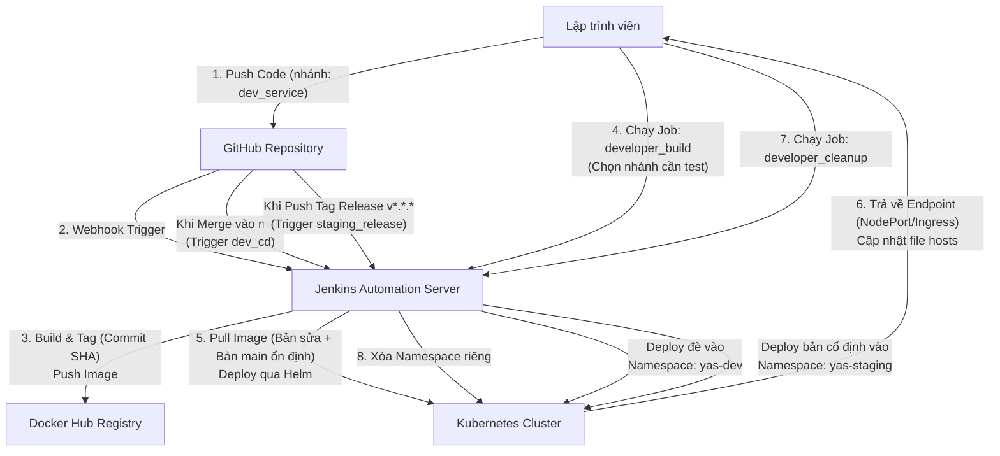

# Quy Trình CI/CD Hoàn Chỉnh Cho Dự Án DevOps 2 (YAS Microservices)

Tài liệu này hướng dẫn chi tiết quy trình CI/CD từ Yêu cầu 1 đến Yêu cầu 6 của đồ án, sử dụng kịch bản thực tế dễ hiểu để lập trình viên và người vận hành có thể tham khảo sau này.

---

## I. Sơ Đồ Quy Trình Hoạt Động (Workflow)

Dưới đây là luồng xử lý tự động của hệ thống từ khi lập trình viên thay đổi mã nguồn cho đến khi ứng dụng chạy trên cụm Kubernetes (K8s):



---

## II. Kịch Bản Ví Dụ Thực Tế

Giả sử nhóm phát triển có 2 thành viên:
*   **Lập trình viên A**: Đang sửa dịch vụ Thuế (`tax-service`).
*   **Lập trình viên B**: Đang sửa dịch vụ Giỏ hàng (`cart-service`).

Quy trình làm việc chuẩn của họ sẽ diễn ra qua các bước dưới đây:

### Bước 1: Phát triển & Build tự động trên nhánh cá nhân (CI - Yêu cầu 3)
1.  **Lập trình viên A** tạo một nhánh Git từ `main` đặt tên là `dev_tax_service`. Anh ấy chỉnh sửa công thức tính thuế trong mã nguồn.
2.  Sau khi lập trình xong, anh A thực hiện lệnh:
    ```bash
    git commit -m "Fix tax calculation formula"
    git push origin dev_tax_service
    ```
3.  **Hệ thống xử lý:**
    *   GitHub gửi tín hiệu đến **Jenkins** qua Webhook.
    *   Jenkins chạy Job CI: clone nhánh `dev_tax_service`, chạy kiểm thử (unit test), build và đóng gói thành Docker Image.
    *   Tag của Image được đặt chính bằng **Commit SHA** mới nhất (ví dụ: `tax-service:c7ec134`).
    *   Image này được đẩy lên **Docker Hub** của nhóm.

---

### Bước 2: Deploy thử nghiệm độc lập để Test (Developer CD - Yêu cầu 4)
Để kiểm tra công thức thuế mới hoạt động đúng trong toàn hệ thống thương mại điện tử YAS (gồm 14 services chạy phối hợp), anh A cần deploy thử.
1.  Anh A đăng nhập vào **Jenkins**, chọn Job **`developer_build`**.
2.  Giao diện Job hiển thị tham số cho từng service:
    *   Tại mục **`tax-service`**: Anh chọn nhánh `dev_tax_service` (hoặc tag `c7ec134`).
    *   Tại mục các service khác (`product`, `cart`, `order`,...): Giữ nguyên mặc định là `main` (hoặc tag `latest`).
3.  **Hệ thống xử lý:**
    *   Jenkins tạo ra một không gian làm việc cô lập trên K8s (Namespace) dành riêng cho anh A: `yas-user-dev-a`.
    *   Jenkins dùng **Helm** triển khai toàn bộ các dịch vụ vào namespace này.
    *   *Đặc biệt:* Dịch vụ `tax-service` sẽ chạy bản sửa lỗi (tag `c7ec134`), các dịch vụ còn lại sẽ chạy bản ổn định chung trên nhánh `main`.
4.  **Truy cập kiểm thử:**
    *   Jenkins hoàn thành và thông báo cổng dịch vụ (NodePort), ví dụ: `http://storefront-dev-a.yas.local:32080`.
    *   Anh A cấu hình file `hosts` trên máy cá nhân:
        ```text
        <worker-node-ip>   storefront-dev-a.yas.local
        ```
    *   Mở trình duyệt truy cập `http://storefront-dev-a.yas.local:32080` để test thử kịch bản mua hàng tính thuế mới.

---

### Bước 3: Dọn dẹp môi trường thử nghiệm (Yêu cầu 5)
1.  Sau khi anh A đã test xong và thấy tính năng chạy ổn định, anh không muốn lãng phí RAM/CPU của cụm Kubernetes.
2.  Anh A vào Jenkins chạy Job **`developer_cleanup`**, điền tham số tên Namespace của mình: `yas-user-dev-a`.
3.  **Hệ thống xử lý:** Jenkins ra lệnh cho Kubernetes xóa sạch Namespace `yas-user-dev-a` cùng toàn bộ Pod và Service bên trong.

---

### Bước 4: Tự động cập nhật Môi trường Dev chung (CD Dev - Yêu cầu 6a)
1.  Anh A tạo Pull Request và **Merge (gộp)** nhánh `dev_tax_service` vào nhánh chính `main` trên GitHub.
2.  **Hệ thống xử lý:**
    *   Jenkins phát hiện nhánh `main` vừa được cập nhật code mới.
    *   Nó tự động build Docker Image mới cho `tax-service` với tag là `main` (hoặc `latest`) và push lên Docker Hub.
    *   Jenkins tự động cập nhật (deploy đè) bản mới này vào Namespace **`yas-dev`** (Môi trường Dev chung của cả đội dự án).
    *   Bây giờ, **Lập trình viên B** khi truy cập môi trường Dev chung sẽ lập tức thấy được tính năng thuế mới mà anh A vừa tích hợp.

---

### Bước 5: Đóng gói phát hành lên Môi trường Staging (CD Staging - Yêu cầu 6b)
Khi cả đội thống nhất phiên bản hiện tại đã chạy ổn định và muốn bàn giao cho bên kiểm thử (Tester) hoặc khách hàng duyệt:
1.  Trưởng nhóm gắn một thẻ Tag phiên bản trên nhánh `main` (ví dụ: `v1.2.3`) và push tag này lên GitHub:
    ```bash
    git tag v1.2.3
    git push origin v1.2.3
    ```
2.  **Hệ thống xử lý:**
    *   Jenkins phát hiện sự kiện tạo Tag phát hành mới dạng `v*`.
    *   Nó kích hoạt Job CD Staging: Đóng gói toàn bộ 14 dịch vụ với nhãn tag chung là `v1.2.3` và đẩy lên Docker Hub.
    *   Deploy phiên bản này vào một Namespace cô lập sạch sẽ gọi là **`yas-staging`** (Môi trường Staging).
    *   Môi trường Staging sẽ được giữ cố định ở phiên bản `v1.2.3` này, giúp Tester yên tâm test mà không lo bị thay đổi code liên tục bởi các commit hàng ngày của Dev trên nhánh `main`.

---

## III. Bảng Tổng Hợp Các Job Trên Jenkins

| Tên Job trên Jenkins | Cách kích hoạt | Tham số đầu vào | Nhiệm vụ chính |
| :--- | :--- | :--- | :--- |
| **`yas-ci`** | Tự động (Webhook từ GitHub) | Không | Tự động build code, test và đóng gói Docker image cho bất kỳ nhánh nào có commit mới. |
| **`yas-developer-build`** | Thủ công (Developer chạy) | Tên nhánh/Tag cho từng service cụ thể | Tạo một Namespace riêng trên K8s, deploy bản mix giữa code sửa lỗi của dev đó và code ổn định của nhóm. |
| **`yas-developer-cleanup`**| Thủ công (Developer chạy) | Tên Namespace cần xóa | Xóa bỏ hoàn toàn namespace thử nghiệm của dev để tiết kiệm tài nguyên hệ thống. |
| **`yas-dev-cd`** | Tự động (Khi merge vào `main`) | Không | Cập nhật bản mới nhất lên môi trường dùng chung (`yas-dev`). |
| **`yas-staging-release`** | Tự động (Khi push Git Tag `v*`) | Không | Đóng gói phiên bản phát hành và deploy lên môi trường Staging ổn định (`yas-staging`). |
