# Báo Cáo Chi Tiết — Đồ Án 2: Xây Dựng Hệ Thống CD Cho YAS

Repo triển khai: `https://github.com/Devop14s/project2`

Ngày chốt trạng thái kỹ thuật: `2026-07-09`

Phạm vi đối chiếu:

- tài liệu yêu cầu chính của đồ án
- tài liệu quy định danh mục service bắt buộc

## Mục lục

1. Mục tiêu báo cáo
2. Yêu cầu đầu bài và phạm vi service
3. Kiến trúc triển khai thực tế
   3.1. Kiến trúc môi trường
   3.2. Kiến trúc hạ tầng
   3.3. Cấu trúc repo triển khai
4. Chuẩn bị môi trường Kubernetes
   4.1. Bật `systemd` trong WSL
   4.2. Cài k3s master
   4.3. Cấu hình `kubectl` cho user
   4.4. Cài k3s worker
   4.5. Tạo namespace dùng cho dev và staging
   4.6. Minh chứng về cụm Kubernetes
5. Chiến lược image và Docker Hub
   5.1. Quy ước image repository
   5.2. Quy ước đặt tag
   5.3. Minh chứng Docker Hub
6. Thiết lập Jenkins và pipeline CI/CD
   6.1. Thành phần Jenkins cần có
   6.2. Job Jenkins khuyến nghị
   6.3. Pipeline CI
   6.4. Tạo image
   6.5. Đẩy image lên registry
   6.6. Kiểm tra tag image trên Docker Hub
   6.7. Minh chứng cho Jenkins CI
7. Jenkins job `developer_build`
   7.1. Mục tiêu
   7.2. Cấu hình pipeline sử dụng
   7.3. Trình tự xử lý của tác vụ
   7.4. Xác định tag theo nhánh nguồn
   7.5. Tạo file values cho môi trường developer
   7.6. Tạo cơ sở dữ liệu riêng cho developer
   7.7. Triển khai Helm cho namespace developer
   7.8. Kiểm tra nhanh sau triển khai
   7.9. Minh chứng cho tác vụ `developer_build`
8. Jenkins job `developer_cleanup`
   8.1. Mục tiêu
   8.2. Cấu hình pipeline sử dụng
   8.3. Cơ chế an toàn
   8.4. Minh chứng cho tác vụ `developer_cleanup`
9. Môi trường dùng chung bằng Helm và script vận hành
   9.1. Kiểm thử nhanh `yas-dev`
   9.2. Kiểm thử nhanh `yas-staging`
   9.3. Triển khai thủ công bằng Helm từ master
10. ArgoCD cho `yas-dev` và `yas-staging`
   10.1. Mục tiêu của quy trình GitOps
   10.2. Các tệp cấu hình ArgoCD
   10.3. Áp dụng manifest `Application`
   10.4. Jenkins cập nhật manifest repo
   10.5. Minh chứng ArgoCD
11. Service Mesh với Istio và Kiali
   11.1. Các tệp cấu hình Service Mesh
   11.2. mTLS
   11.3. Kiali topology
   11.4. Retry policy
   11.5. Authorization policy
12. Kiểm thử end-to-end
   12.1. Kiểm tra trạng thái workload trong `yas-dev`
   12.2. Giao diện storefront
   12.3. Giao diện backoffice
   12.4. Bộ lệnh kiểm tra nhanh cho giao diện và BFF
   12.5. Các luồng API chính
   12.6. Giao diện Swagger
   12.7. Keycloak
13. Đối chiếu 14 service theo tài liệu yêu cầu service
14. Bảng đối chiếu yêu cầu và minh chứng
   14.1. Yêu cầu bắt buộc
   14.2. Phần nâng cao ArgoCD
   14.3. Phần nâng cao Service Mesh
   14.4. End-to-end
15. Danh sách ảnh và tệp minh chứng
16. Kết luận cuối cùng

---

## 1. Mục tiêu báo cáo

Mục tiêu của báo cáo này là trình bày một cách đầy đủ quy trình triển khai CI/CD cho hệ thống YAS theo đúng yêu cầu của đồ án:

- chuẩn hóa image Docker cho toàn bộ service
- xây dựng cụm Kubernetes tối thiểu `1 master + 1 worker`
- thiết lập pipeline Jenkins cho CI, triển khai môi trường dành cho người phát triển và cơ chế dọn dẹp môi trường
- triển khai `dev` và `staging` theo hướng GitOps bằng ArgoCD
- cấu hình Service Mesh với `mTLS`, `retry policy`, `authorization policy`
- kiểm thử end-to-end bằng lệnh dòng lệnh và trình duyệt

Báo cáo này không viết theo kiểu nhật ký sự cố. Thay vào đó, tài liệu được tổ chức theo đúng các hạng mục kỹ thuật cần để một người khác có thể:

- hiểu kiến trúc hệ thống
- dựng lại môi trường
- chạy lại pipeline
- đối chiếu minh chứng kỹ thuật
- kiểm tra từng yêu cầu của đề bài

---

## 2. Yêu cầu đầu bài và phạm vi service

Theo tài liệu yêu cầu chính của đồ án, phần bắt buộc gồm 5 yêu cầu kỹ thuật chính:

1. Mỗi service có image mặc định với tag `main` hoặc `latest`.
2. Có cụm Kubernetes tối thiểu `1 master + 1 worker`.
3. Với mỗi nhánh làm việc của người phát triển, sau mỗi lần commit hệ thống phải tạo image với tag là `commit id` cuối cùng của nhánh đó và đẩy lên Docker Hub.
4. Có tác vụ Jenkins `developer_build` cho phép triển khai môi trường riêng theo tham số nhánh nguồn, đồng thời cung cấp `domain:port` dạng `NodePort`.
5. Có tác vụ Jenkins để xóa môi trường được tạo ở mục 4.

Phần nâng cao đặt ra các yêu cầu sau:

- dùng ArgoCD để quản lý `dev` và `staging`
- dùng Service Mesh để bật `mTLS`, quan sát topology bằng Kiali, cấu hình retry, kiểm thử allow/deny bằng `curl` từ pod trong cluster

Theo tài liệu quy định danh mục service, nhóm service bắt buộc trong phạm vi đồ án gồm 14 service:

| STT | Service | Vai trò |
|---|---|---|
| 1 | `product` | quản lý sản phẩm |
| 2 | `cart` | giỏ hàng |
| 3 | `order` | đơn hàng |
| 4 | `customer` | thông tin khách hàng |
| 5 | `inventory` | tồn kho |
| 6 | `tax` | tính thuế |
| 7 | `media` | media / ảnh |
| 8 | `search` | tìm kiếm |
| 9 | `storefront-bff` | BFF cho storefront |
| 10 | `storefront` | giao diện người dùng storefront |
| 11 | `backoffice-bff` | BFF cho backoffice |
| 12 | `backoffice` | giao diện quản trị backoffice |
| 13 | `swagger-ui` | tài liệu API |
| 14 | `sampledata` | dữ liệu mẫu, thực thi một lần để nạp dữ liệu ban đầu |

Lưu ý quan trọng:

- `sampledata` là service đặc biệt: mục tiêu là seed dữ liệu, không cần chạy thường trực như các service còn lại.
- `Kafka`, `Kafka Connect`, `Elasticsearch`, `PostgreSQL`, `Redis`, `Keycloak` không nằm trong danh sách 14 service bắt buộc, nhưng là hạ tầng phụ trợ cần có để hệ thống vận hành đúng.

---

## 3. Kiến trúc triển khai thực tế

### 3.1 Kiến trúc môi trường

Hệ thống được vận hành theo ba lớp môi trường:

| Môi trường | Namespace | Cơ chế triển khai | Mục đích |
|---|---|---|---|
| Developer sandbox | `yas-user-<deployer-id>` | Jenkins `developer_build` + Helm | kiểm thử nhánh phát triển riêng của từng thành viên |
| Dev | `yas-dev` | Jenkins cập nhật manifest + ArgoCD tự đồng bộ | môi trường tích hợp liên tục |
| Staging | `yas-staging` | Jenkins cập nhật manifest + ArgoCD đồng bộ có kiểm soát | môi trường kiểm thử trước phát hành |

### 3.2 Kiến trúc hạ tầng

Tại thời điểm chốt báo cáo, cluster chạy trên 2 node:

- `k3s-master`: control-plane
- `k3s-worker`: worker node

Ba giao diện công khai chính:

- `storefront`
- `backoffice`
- `swagger-ui`

được cố định trên node master bằng profile `ui-on-master` nhằm bảo đảm khả năng truy cập ổn định trong quá trình kiểm thử và trình diễn; phần lớn workload phía backend được bố trí trên worker node.

### 3.3 Cấu trúc repo triển khai

Các thư mục chính trong repo này:

| Thư mục | Nội dung |
|---|---|
| `setup/scripts/` | script dựng WSL + k3s master/worker + kubeconfig + namespace |
| `jenkins/pipelines/` | định nghĩa pipeline Jenkins |
| `jenkins/scripts/` | các script shell thực thi build, push, triển khai và kiểm tra nhanh |
| `argocd/` | manifest `Application` và file values cho quy trình GitOps |
| `mesh/` | manifest Service Mesh: `PeerAuthentication`, `DestinationRule`, `VirtualService`, `AuthorizationPolicy` |
| `helm/yas/` | Helm chart dùng để triển khai hệ thống |
| `run-dev.sh`, `run-staging.sh` | script hỗ trợ mở endpoint cục bộ và kiểm tra nhanh thủ công |
| `docs/screenshots/` | tập hợp ảnh và bản ghi dùng làm minh chứng |

Các thành phần kỹ thuật quan trọng phục vụ đối chiếu yêu cầu gồm:

- quy trình CI
- tác vụ triển khai môi trường riêng cho người phát triển
- tác vụ xóa môi trường riêng
- cấu hình ArgoCD cho môi trường `dev`
- cấu hình ArgoCD cho môi trường `staging`
- cấu hình `PeerAuthentication`
- cấu hình `AuthorizationPolicy`
- cấu hình `VirtualService` cho cơ chế retry

---

## 4. Chuẩn bị môi trường Kubernetes

Phần này trình bày quy trình dựng cụm `k3s` 2 node theo đúng cách triển khai đã sử dụng.

### 4.1 Bật `systemd` trong WSL

Nội dung chạy:

```bash
sudo tee /etc/wsl.conf > /dev/null <<'EOF'
[boot]
systemd=true
EOF
```

Thực thi:

```bash
cd /home/luong/project2
bash setup/scripts/01-enable-systemd.sh
```

Sau đó từ Windows PowerShell:

```powershell
wsl --shutdown
```

và mở lại WSL.

### 4.2 Cài k3s master

Thực thi:

```bash
cd /home/luong/project2
bash setup/scripts/02-install-k3s-master.sh <MASTER_NODE_IP>
```

Ví dụ:

```bash
bash setup/scripts/02-install-k3s-master.sh 100.96.101.91
```

Lệnh cài đặt thực hiện:

```bash
sudo hostnamectl set-hostname k3s-master

curl -sfL https://get.k3s.io | \
  sudo INSTALL_K3S_EXEC="server --node-name k3s-master --bind-address 0.0.0.0 --advertise-address ${master_node_ip}" \
  sh -
```

Kiểm tra sau cài:

```bash
sudo systemctl status k3s --no-pager
sudo kubectl get nodes -o wide
sudo cat /var/lib/rancher/k3s/server/node-token
```

### 4.3 Cấu hình `kubectl` cho user

Thực thi:

```bash
cd /home/luong/project2
bash setup/scripts/04-configure-kubectl.sh <MASTER_NODE_IP>
```

Ví dụ:

```bash
bash setup/scripts/04-configure-kubectl.sh 100.96.101.91
```

Lệnh cấu hình thực hiện:

```bash
mkdir -p "$HOME/.kube"
sudo cp /etc/rancher/k3s/k3s.yaml "$HOME/.kube/config"
sudo chown "$(id -u)":"$(id -g)" "$HOME/.kube/config"
sed -i "s/127.0.0.1/${master_node_ip}/g" "$HOME/.kube/config"
```

Kiểm tra:

```bash
kubectl get nodes
grep server: ~/.kube/config
```

### 4.4 Cài k3s worker

Thực thi:

```bash
cd /home/luong/project2
bash setup/scripts/03-install-k3s-worker.sh <MASTER_NODE_IP> <NODE_TOKEN>
```

Ví dụ:

```bash
bash setup/scripts/03-install-k3s-worker.sh 100.96.101.91 K10...
```

Lệnh cài đặt thực hiện:

```bash
sudo hostnamectl set-hostname k3s-worker

curl -sfL https://get.k3s.io | \
  sudo K3S_URL="https://${master_node_ip}:6443" \
  K3S_TOKEN="${node_token}" \
  INSTALL_K3S_EXEC="agent --node-name k3s-worker" \
  sh -
```

Kiểm tra sau join:

```bash
sudo systemctl status k3s-agent --no-pager
kubectl get nodes -o wide
```

Lưu ý:

- trên worker, service đúng là `k3s-agent`, không phải `k3s`
- vì vậy lệnh `sudo systemctl start k3s` trên worker sẽ báo `Unit k3s.service not found`

### 4.5 Tạo namespace dùng cho dev và staging

Thực thi:

```bash
cd /home/luong/project2
bash setup/scripts/05-create-namespaces.sh
```

Lệnh thực tế:

```bash
kubectl create namespace yas-dev --dry-run=client -o yaml | kubectl apply -f -
kubectl create namespace yas-staging --dry-run=client -o yaml | kubectl apply -f -
```

Kiểm tra:

```bash
kubectl get ns | grep -E 'yas-dev|yas-staging'
```

### 4.6 Minh chứng về cụm Kubernetes

Lệnh kiểm tra:

```bash
sudo k3s kubectl get nodes -o wide
```

Ảnh minh chứng:

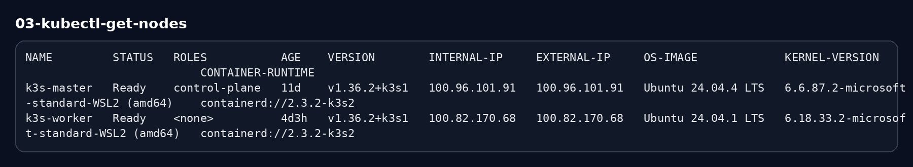

Bản ghi đối chiếu tương ứng:

- `docs/screenshots/03-kubectl-get-nodes.txt`

Kết luận:

- yêu cầu về cụm Kubernetes gồm `1 master + 1 worker` đã được đáp ứng

---

## 5. Chiến lược image và Docker Hub

### 5.1 Quy ước image repository

Quy ước đặt tên image được chuẩn hóa như sau:

```bash
image_repo() {
  local service="$1"
  require_env DOCKERHUB_NAMESPACE
  printf '%s/yas-%s' "$DOCKERHUB_NAMESPACE" "$service"
}
```

Với namespace Docker Hub là `luongtrz`, các image được tạo theo quy ước:

```text
luongtrz/yas-product
luongtrz/yas-cart
luongtrz/yas-order
...
```

### 5.2 Quy ước đặt tag

Tag được resolve bởi:

- `RELEASE_VERSION` nếu được truyền vào
- hoặc `work/commit_short_sha.txt`
- hoặc `git rev-parse --short=7 HEAD`

Đây là cơ chế xác định tag được áp dụng nhất quán trong pipeline.

Do đó, mỗi image có hai nhóm tag quan trọng:

- tag chuẩn cơ sở: `main`
- tag theo mã định danh commit rút gọn, ví dụ `179e813`

### 5.3 Minh chứng Docker Hub

Ảnh danh sách repository:

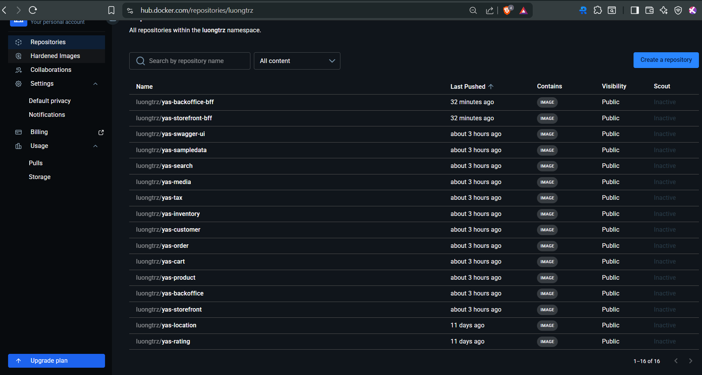

Ảnh chi tiết tag của một service:

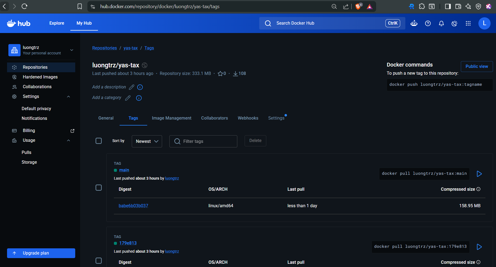

Từ ảnh #2 có thể thấy rõ:

- repo `luongtrz/yas-tax`
- tag `main`
- tag commit `179e813`

Kết luận:

- yêu cầu “mỗi service có image mặc định”
- và yêu cầu “CI tạo image với commit id”

đều được thỏa mãn ở tầng registry.

---

## 6. Thiết lập Jenkins và pipeline CI/CD

### 6.1 Thành phần Jenkins cần có

Theo tài liệu vận hành Jenkins của đồ án, agent Jenkins cần tối thiểu:

- `git`
- `docker`
- `kubectl`
- `helm`
- `bash`

Credential bắt buộc:

| Credential ID | Kiểu | Mục đích |
|---|---|---|
| `dockerhub-creds` | username/password | login Docker Hub |
| `kubeconfig-file` | secret file | truy cập Kubernetes |
| `dockerhub-namespace-text` | secret text, optional | truyền namespace Docker Hub |

### 6.2 Job Jenkins khuyến nghị

Theo tài liệu vận hành Jenkins, các job chuẩn gồm:

- `yas-ci`
- `yas-developer-build`
- `yas-developer-cleanup`
- `yas-dev-cd`
- `yas-staging-release`

Trong triển khai thực tế của đồ án, các luồng xử lý quan trọng cần có để đáp ứng tiêu chí chấm điểm gồm:

- quy trình CI tạo và đẩy image
- `developer_build`
- `developer_cleanup`
- `dev_gitops`
- `staging_gitops`

### 6.3 Pipeline CI

Pipeline CI được mô tả trong cấu hình Jenkins của đồ án.

Các stage chính trong pipeline:

1. `Checkout`
2. `Resolve Commit Metadata`
3. `Docker Login`
4. `Prepare Custom Dockerfiles`
5. `Maven Build`
6. `Build Images`
7. `Push Images`
8. `Verify Image Tags`

Trình tự lệnh:

```groovy
stage('Resolve Commit Metadata') {
  sh 'jenkins/scripts/write-commit-metadata.sh'
  env.RELEASE_VERSION = readFile('work/commit_short_sha.txt').trim()
}

stage('Docker Login') {
  withCredentials([usernamePassword(credentialsId: 'dockerhub-creds', usernameVariable: 'DOCKER_USER', passwordVariable: 'DOCKER_PASS')]) {
    sh 'jenkins/scripts/docker-login.sh'
  }
}

stage('Maven Build') {
  sh 'jenkins/scripts/maven-build.sh'
}

stage('Build Images') {
  sh 'jenkins/scripts/build-images.sh'
}

stage('Push Images') {
  sh 'jenkins/scripts/push-images.sh'
}

stage('Verify Image Tags') {
  sh 'jenkins/scripts/verify-image-tags.sh'
}
```

### 6.4 Tạo image

Chức năng:

- đọc service catalog
- xác định `repo:tag`
- tạo từng image
- ghi tạo phẩm kỹ thuật của quá trình build vào `work/`

Các kết quả kỹ thuật điển hình được ghi nhận dưới dạng:

- `work/built-image-list.txt`
- `work/build-metadata.json`

### 6.5 Đẩy image lên registry

Hành vi chuẩn:

- đẩy tag theo commit SHA
- nếu tag hiện tại khác `main` thì đẩy thêm `:main`

Điểm này rất quan trọng vì nó đáp ứng đồng thời:

- môi trường cơ sở luôn có `main`
- image của nhánh phát triển riêng vẫn có `commit id`

### 6.6 Kiểm tra tag image trên Docker Hub

Trong bước kiểm tra tag, hệ thống gọi trực tiếp Docker Hub API để xác minh tag đã tồn tại trên registry trước khi triển khai:

```bash
https://hub.docker.com/v2/repositories/${repo}/tags/${tag}/
```

Ý nghĩa:

- tránh triển khai nhầm tag chưa được đẩy lên registry
- giúp `developer_build` dừng sớm nếu nhánh được chỉ định chưa có image hợp lệ

### 6.7 Minh chứng cho Jenkins CI

Ảnh danh sách branch của Multibranch job:

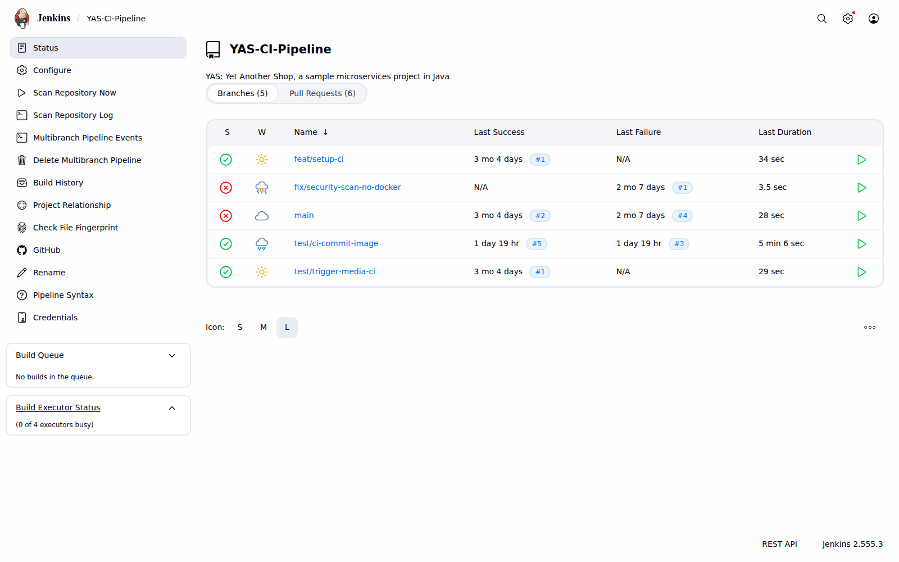

Ảnh danh sách pull request được index:

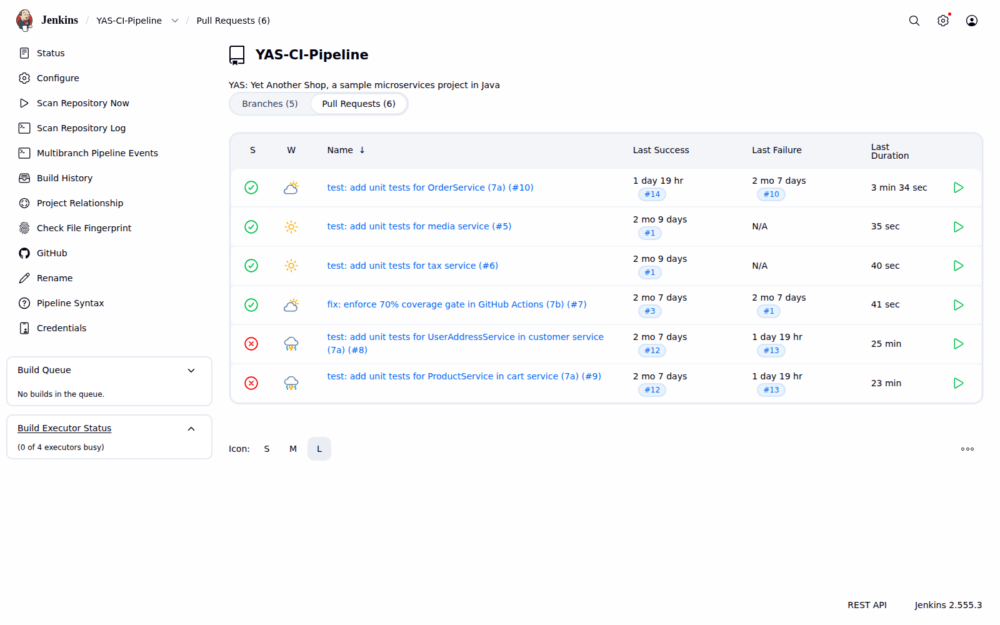

Ảnh chụp console của quá trình tạo và đẩy image:

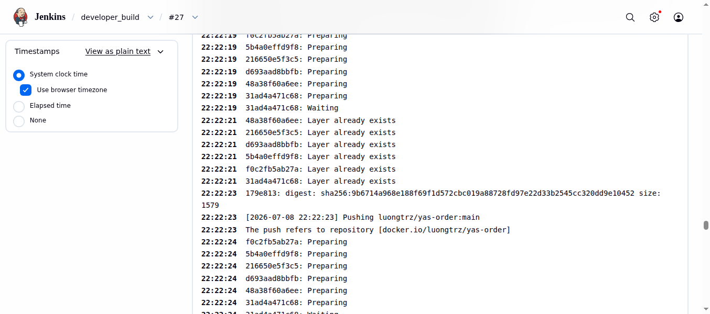

Ảnh log auto-trigger/indexing:

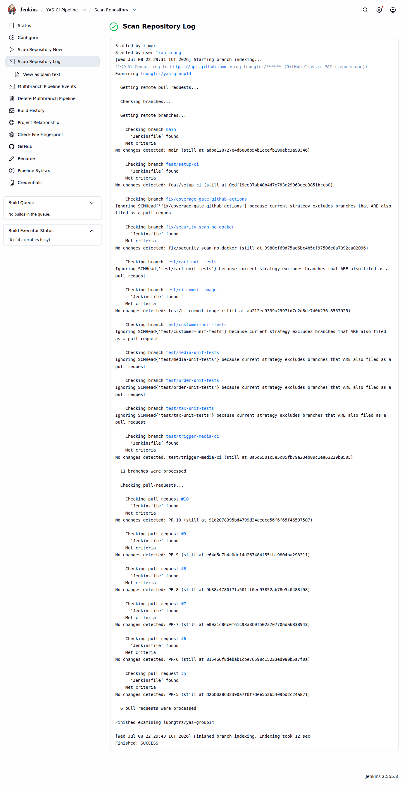

Ảnh Polling Log — Jenkins tự so sánh revision Git cũ (last built) với revision mới nhất trên remote, phát hiện khác nhau và ghi nhận "Changes found":

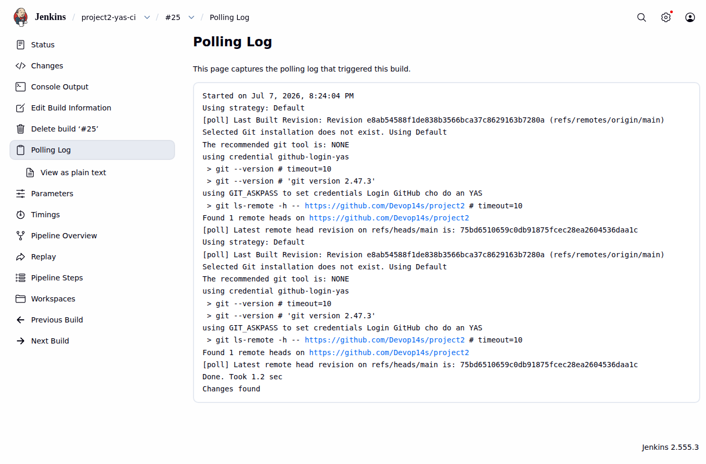

Ảnh trang Status của build được tạo ra, dòng nguyên nhân trigger hiển thị rõ "Started by an SCM change":

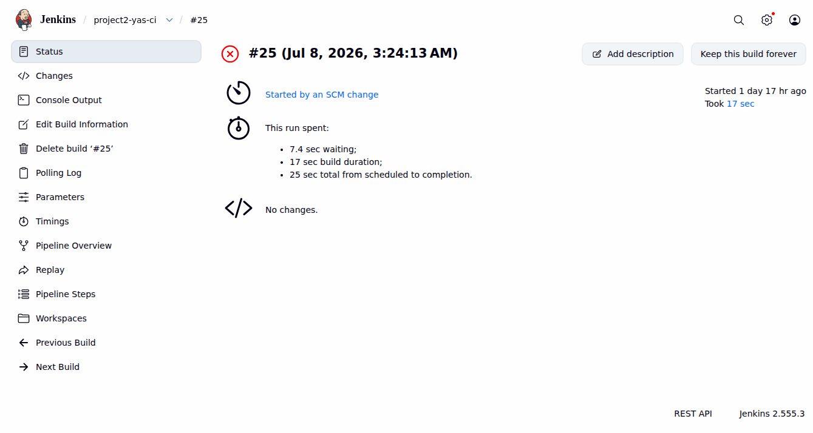

Bổ sung cho ảnh chụp màn hình, báo cáo còn lưu các bản ghi ở dạng văn bản/XML/JSON tương ứng:

- `docs/screenshots/06b-jenkins-scm-polling-autotrigger.txt`
- `docs/screenshots/06c-project2-yas-ci-25-cause.xml`
- `docs/screenshots/06c-project2-yas-ci-25-cause.json`

Kết luận:

- pipeline CI đã tạo image theo commit
- image đã được đẩy lên Docker Hub
- cơ chế kích hoạt và quét nhánh đã có minh chứng tương ứng

---

## 7. Tác vụ Jenkins `developer_build`

### 7.1 Mục tiêu

Yêu cầu số 4 của đề bài đặt ra một tác vụ CD dành cho người phát triển với các đặc điểm sau:

- cho phép khai báo nhánh nguồn riêng theo từng service
- triển khai môi trường riêng biệt
- các service còn lại dùng tag `main`
- trả về `domain name:port` để người phát triển kiểm tra trực tiếp

### 7.2 Cấu hình pipeline sử dụng

Các tham số chính:

- `DEPLOYER_ID`
- `SERVICE_CATALOG`
- `DOCKERHUB_NAMESPACE`
- `DOMAIN_NAME`
- `BACKOFFICE_DOMAIN_NAME`
- `STOREFRONT_BRANCH`
- `BACKOFFICE_BRANCH`
- `STOREFRONT_BFF_BRANCH`
- `BACKOFFICE_BFF_BRANCH`
- `PRODUCT_BRANCH`
- `MEDIA_BRANCH`
- `CART_BRANCH`
- `CUSTOMER_BRANCH`
- `ORDER_BRANCH`
- `INVENTORY_BRANCH`
- `TAX_BRANCH`
- `SEARCH_BRANCH`
- ...

### 7.3 Trình tự xử lý của tác vụ

Các giai đoạn chính:

1. `Checkout`
2. `Resolve Branch Tags`
3. `Docker Login`
4. `Verify Image Tags`
5. `Generate Values`
6. `Provision Databases`
7. `Deploy`
8. `Smoke Test`

Trích đoạn pipeline:

```groovy
stage('Resolve Branch Tags') {
  sh 'jenkins/scripts/resolve-branch-tags.sh'
}

stage('Verify Image Tags') {
  sh 'jenkins/scripts/verify-image-tags.sh'
}

stage('Generate Values') {
  sh 'jenkins/scripts/generate-values.sh'
}

stage('Provision Databases') {
  withCredentials([file(credentialsId: 'kubeconfig-file', variable: 'KUBECONFIG')]) {
    sh 'jenkins/scripts/provision-dev-databases.sh'
  }
}

stage('Deploy') {
  withCredentials([file(credentialsId: 'kubeconfig-file', variable: 'KUBECONFIG')]) {
    sh 'jenkins/scripts/deploy-helm.sh'
  }
}

stage('Smoke Test') {
  withCredentials([file(credentialsId: 'kubeconfig-file', variable: 'KUBECONFIG')]) {
    sh 'jenkins/scripts/smoke-test.sh'
  }
}
```

### 7.4 Xác định tag theo nhánh nguồn

Trong quá trình thực thi, script phân giải tag sẽ tạo ánh xạ service → tag như sau:

- nhánh chỉ định khác `main` → lấy `commit SHA` của nhánh đó
- nhánh mặc định `main` → dùng tag `main`

Ý nghĩa:

- phù hợp với ví dụ `dev_tax_service` trong đề bài
- không cần biên dịch lại toàn bộ nếu image của nhánh tương ứng đã tồn tại trên Docker Hub

### 7.5 Tạo file values cho môi trường developer

Trong giai đoạn sinh cấu hình triển khai, hệ thống tạo ra tệp:

- `work/generated-values.yaml`

File này chứa:

- `namespace`
- `releaseName`
- `domain`
- `backofficeDomain`
- image repository/tag cho từng service
- cấu hình phân bổ workload

### 7.6 Tạo cơ sở dữ liệu riêng cho developer

Chỉ chạy khi:

```bash
ENVIRONMENT=developer
```

Danh sách DB được tạo:

- `cart_<deployer_id>`
- `order_<deployer_id>`
- `customer_<deployer_id>`
- `inventory_<deployer_id>`
- `tax_<deployer_id>`
- `media_<deployer_id>`
- `search_<deployer_id>`
- `product_<deployer_id>`

Lệnh thực tế trong script:

```bash
kubectl exec -n "$POSTGRES_NAMESPACE" "$POSTGRES_POD" -- psql -U admin -d postgres -tAc \
  "SELECT 1 FROM pg_database WHERE datname='${db_name}'"
```

và nếu chưa có:

```bash
kubectl exec -n "$POSTGRES_NAMESPACE" "$POSTGRES_POD" -- psql -U admin -d postgres -c "CREATE DATABASE ${db_name};"
```

### 7.7 Triển khai Helm cho namespace developer

Lệnh triển khai cốt lõi:

```bash
kubectl create namespace "$NAMESPACE" --dry-run=client -o yaml | kubectl apply -f -

helm upgrade --install "$RELEASE_NAME" helm/yas \
  --namespace "$NAMESPACE" \
  --create-namespace \
  -f helm/yas/values.yaml \
  -f "$VALUES_FILE" \
  --timeout "$HELM_TIMEOUT"
```

Sau khi triển khai, script hiển thị:

```bash
kubectl get pods -n "$NAMESPACE"
kubectl get svc -n "$NAMESPACE"
kubectl get ingress -n "$NAMESPACE" || true
```

### 7.8 Kiểm tra nhanh sau triển khai

Trong bước kiểm tra nhanh sau triển khai, hệ thống thực hiện:

- quét catalog service
- tìm các service `expose=true`
- xác định `NodePort`
- ghép tên miền theo mẫu `storefront-<deployer-id>.yas.local`
- ghi endpoint vào file:

```text
work/runtime-evidence/<namespace>/<release>/public-endpoints.txt
```

Đây là bước đáp ứng trực tiếp yêu cầu “trả ra domain name:port” để người phát triển tự khai báo trong file `hosts`.

### 7.9 Minh chứng cho tác vụ `developer_build`

Ảnh form parameter:

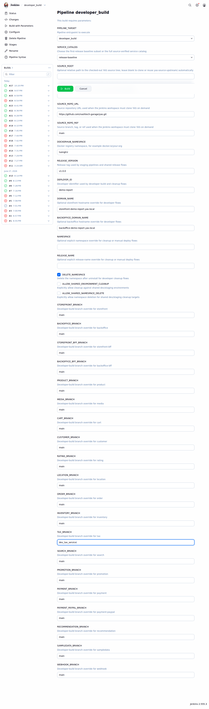

Ảnh console trả NodePort:

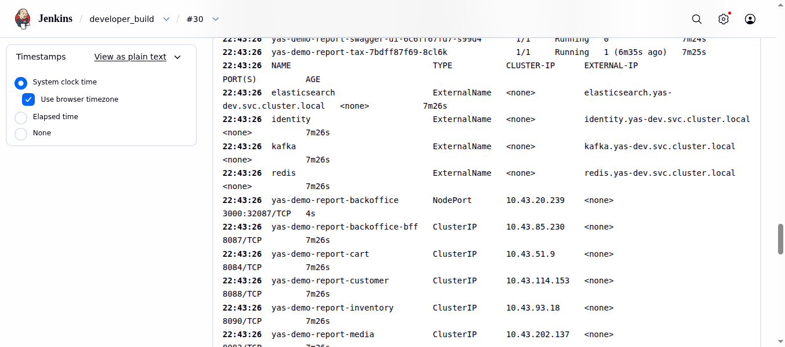

Ảnh storefront môi trường developer:

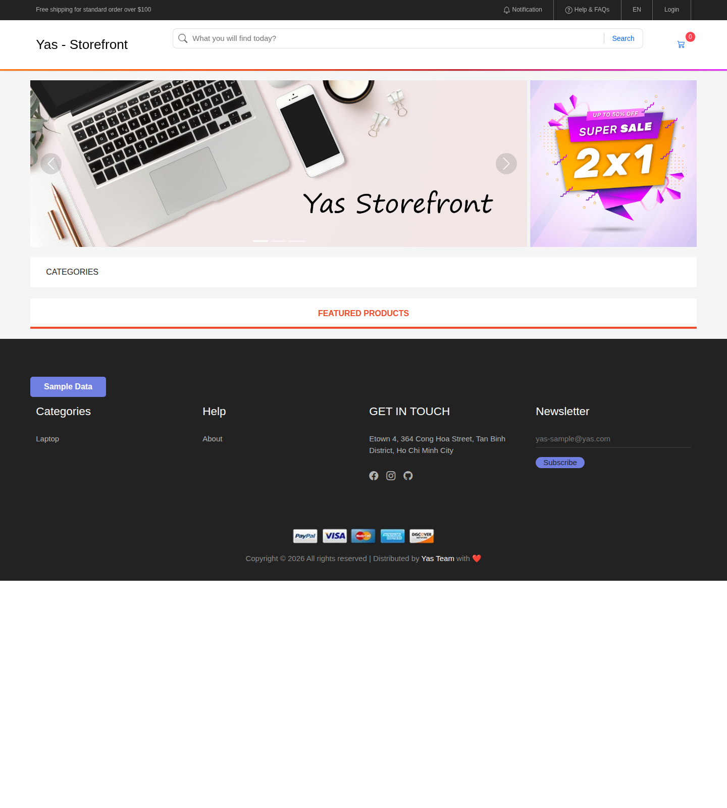

Ảnh pod trong namespace developer:

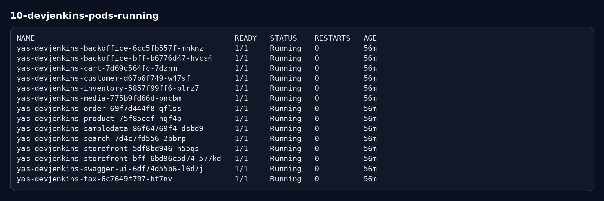

Bản ghi đối chiếu tương ứng:

- `docs/screenshots/10-devjenkins-pods-running.txt`

Kết luận:

- tác vụ `developer_build` triển khai được môi trường riêng
- trả ra endpoint dạng `NodePort`
- phù hợp với yêu cầu của đề bài

---

## 8. Tác vụ Jenkins `developer_cleanup`

### 8.1 Mục tiêu

Yêu cầu số 5 của đề bài là phải có một tác vụ Jenkins để xóa môi trường do `developer_build` tạo ra.

### 8.2 Cấu hình pipeline sử dụng

Các tham số:

- `DEPLOYER_ID`
- `SERVICE_CATALOG`
- `NAMESPACE`
- `RELEASE_NAME`
- `DELETE_NAMESPACE`
- `ALLOW_SHARED_ENVIRONMENT_CLEANUP`
- `ALLOW_SHARED_NAMESPACE_DELETE`

Giai đoạn dọn dẹp:

```groovy
stage('Cleanup') {
  withCredentials([file(credentialsId: 'kubeconfig-file', variable: 'KUBECONFIG')]) {
    sh '''
      export DEPLOYER_ID="${DEPLOYER_ID}"
      export NAMESPACE="${NAMESPACE}"
      export RELEASE_NAME="${RELEASE_NAME}"
      export DELETE_NAMESPACE="${DELETE_NAMESPACE}"
      export ALLOW_SHARED_ENVIRONMENT_CLEANUP="${ALLOW_SHARED_ENVIRONMENT_CLEANUP}"
      export ALLOW_SHARED_NAMESPACE_DELETE="${ALLOW_SHARED_NAMESPACE_DELETE}"
      jenkins/scripts/cleanup-release.sh
    '''
  }
}
```

### 8.3 Cơ chế an toàn

README của Jenkins nêu rõ cơ chế dọn dẹp:

- mặc định chỉ dùng cho môi trường developer
- từ chối xóa môi trường dùng chung nếu không bật cờ xác nhận
- chỉ xóa namespace khi `DELETE_NAMESPACE=true`

Điều này nhằm ngăn ngừa việc xóa nhầm `yas-dev` hoặc `yas-staging`.

### 8.4 Minh chứng cho tác vụ `developer_cleanup`

Ảnh form cleanup:

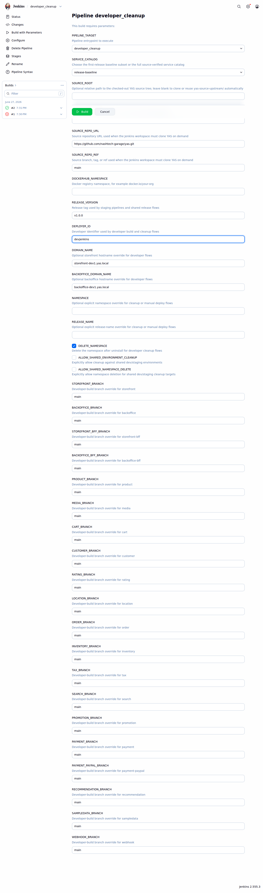

Ảnh console cleanup:

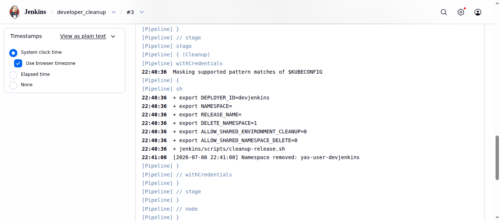

Ảnh xác nhận namespace đã biến mất:

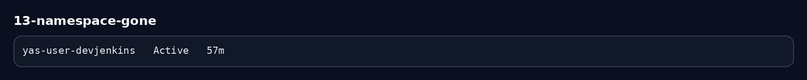

Bản ghi đối chiếu tương ứng:

- `docs/screenshots/13-namespace-gone.txt`

Kết luận:

- yêu cầu về tác vụ Jenkins dùng để xóa triển khai đã được đáp ứng

---

## 9. Môi trường dùng chung bằng Helm và cơ chế vận hành

Ngoài luồng Jenkins, hệ thống còn được vận hành trực tiếp từ master node để phục vụ kiểm tra và khôi phục nhanh khi cần.

### 9.1 Kiểm thử nhanh `yas-dev`

Sau khi chạy lệnh, hệ thống thực hiện các bước sau:

- resolve `InternalIP` của master
- in sẵn cấu hình `hosts`
- in sẵn các URL truy cập qua trình duyệt
- gọi `curl` kiểm tra:
  - storefront `/`
  - storefront `/oauth2/authorization/keycloak`
  - storefront `/actuator/health/liveness`
  - storefront `/actuator/health/readiness`
  - backoffice `/`
  - backoffice `/login`
  - backoffice `/oauth2/authorization/api-client`
  - swagger `/`
  - keycloak `/.well-known/openid-configuration`

Lệnh chạy:

```bash
cd /home/luong/project2
bash run-dev.sh
```

### 9.2 Kiểm thử nhanh `yas-staging`

Sau khi chạy lệnh, hệ thống thực hiện các bước sau:

- mở `kubectl port-forward` cho các service staging
- chờ local port sẵn sàng
- chạy `curl_check` lên các URL `127.0.0.1:<port>`

Lệnh chạy:

```bash
cd /home/luong/project2
bash run-staging.sh
```

### 9.3 Thao tác triển khai thủ công bằng Helm từ master

Trong quá trình vận hành thực tế, môi trường `dev` dùng chung được triển khai bằng lệnh dạng:

```bash
cd /home/luong/project2
helm upgrade --install yas-dev ./helm/yas -n yas-dev \
  -f ./helm/yas/values.yaml \
  -f ./helm/yas/values-dev-dual-worker.yaml
```

Hoặc staging:

```bash
helm upgrade --install yas-staging ./helm/yas -n yas-staging \
  -f ./helm/yas/values.yaml \
  -f ./helm/yas/values-staging.yaml
```

Nhóm lệnh vận hành này không thay thế Jenkins/ArgoCD, nhưng hữu ích để:

- khởi tạo nhanh cụm
- kiểm tra nhanh trước khi đưa vào quy trình GitOps
- khôi phục môi trường khi cần

---

## 10. ArgoCD cho `yas-dev` và `yas-staging`

### 10.1 Mục tiêu của quy trình GitOps

Phần nâng cao yêu cầu:

- Jenkins tạo và đẩy image
- Jenkins cập nhật repo manifest
- ArgoCD theo dõi repository và đồng bộ xuống cluster

### 10.2 Thành phần cấu hình ArgoCD

Cấu hình ArgoCD của hệ thống gồm:

- một application cho môi trường `dev`
- một application cho môi trường `staging`
- một file values cho `dev`
- một file values cho `staging`

Nguyên tắc vận hành:

- `app-dev.yaml` tự đồng bộ kèm `prune` và `selfHeal`
- `app-staging.yaml` đồng bộ thủ công

### 10.3 Bước triển khai ArgoCD Application

Lệnh apply:

```bash
kubectl apply -f argocd/app-dev.yaml
kubectl apply -f argocd/app-staging.yaml
```

Kiểm tra:

```bash
kubectl -n argocd get applications
```

### 10.4 Bước cập nhật manifest từ Jenkins

Trong bước cập nhật manifest, hệ thống thực hiện trình tự sau:

1. cập nhật lại file values cho quy trình GitOps
2. `git add`
3. `git commit`
4. `git push origin HEAD:<branch>`

Lệnh lõi:

```bash
TAGS_FILE="${TAGS_FILE}" \
OUTPUT_FILE="${VALUES_FILE}" \
ENVIRONMENT="${ENVIRONMENT}" \
NAMESPACE="${NAMESPACE_NAME}" \
DOMAIN_NAME="${DOMAIN_NAME}" \
BACKOFFICE_DOMAIN_NAME="${BACKOFFICE_DOMAIN_NAME}" \
RELEASE_VERSION="${TAG}" \
sh scripts/generate-gitops-values.sh
```

sau đó:

```bash
git add "${VALUES_FILE}"
git commit -m "${MANIFEST_COMMIT_MESSAGE}"
git push origin "HEAD:${MANIFEST_BRANCH}"
```

Trong quá trình này, hệ thống đồng thời tạo thêm tệp metadata:

- `work/manifest-update-metadata.json`

### 10.5 Minh chứng ArgoCD

Ảnh dashboard:

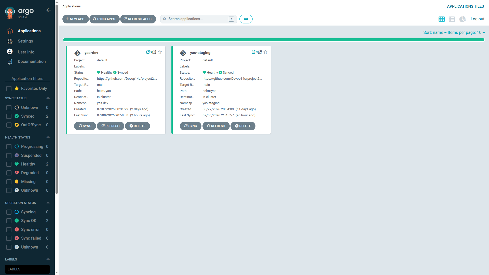

Ảnh resource tree `yas-dev`:

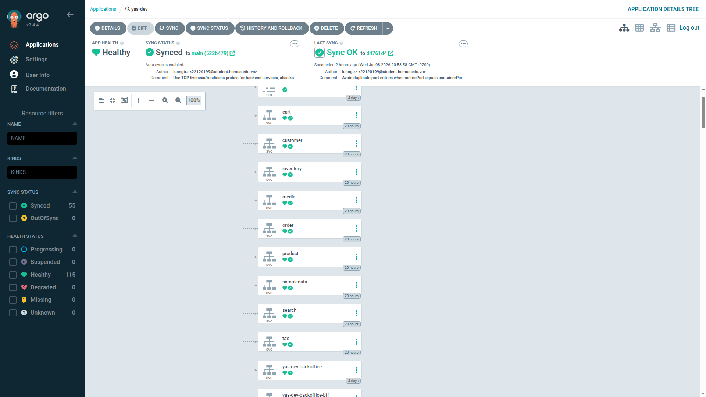

Ảnh resource tree `yas-staging`:

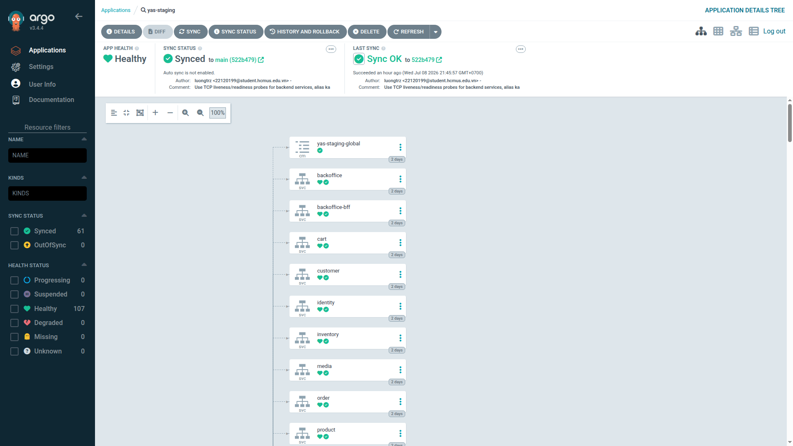

Kết quả chốt:

- `yas-dev`: `Synced / Healthy`
- `yas-staging`: `Synced / Healthy`

Kết luận:

- phần nâng cao ArgoCD đã được đáp ứng

---

## 11. Service Mesh với Istio và Kiali

### 11.1 Thành phần cấu hình Service Mesh

Cấu hình Service Mesh của hệ thống gồm:

- cấu hình `PeerAuthentication`
- cấu hình `DestinationRule`
- cấu hình `AuthorizationPolicy`
- cấu hình `VirtualService` cho retry
- cấu hình ngoại lệ cho các dịch vụ hạ tầng không dùng sidecar

Thứ tự áp dụng đúng là:

1. triển khai workload vào `yas-dev`
2. áp dụng `PeerAuthentication`
3. áp dụng `DestinationRule`
4. áp dụng cấu hình ngoại lệ cho hạ tầng
5. áp dụng `AuthorizationPolicy`
6. áp dụng `VirtualService` cho retry

### 11.2 Bước cấu hình mTLS

Lệnh áp dụng:

```bash
kubectl apply -f mesh/peer-authentication.yaml
kubectl apply -f mesh/destination-rule.yaml
kubectl apply -f infra/infra-destination-rules.yaml
```

Lệnh kiểm tra:

```bash
kubectl get peerauthentication,destinationrule -n yas-dev
```

Ảnh minh chứng:

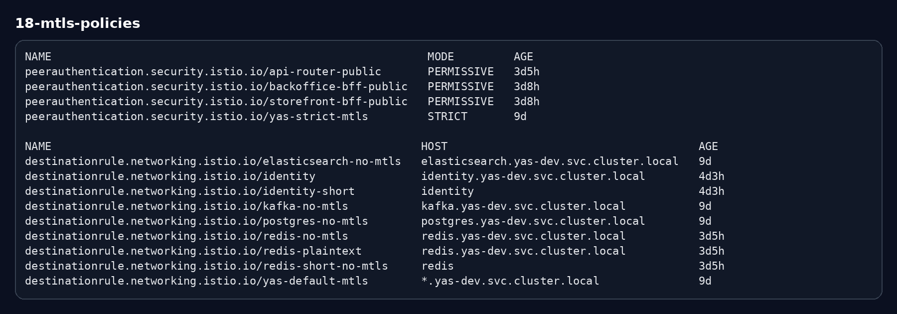

Ảnh trạng thái pod có sidecar:

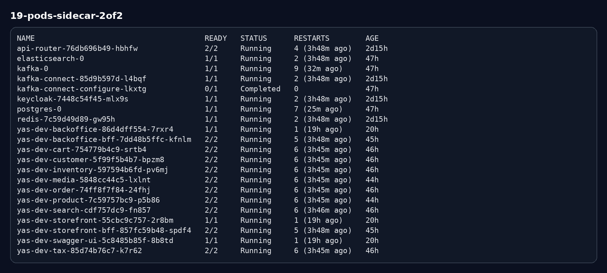

Bản ghi đối chiếu tương ứng:

- `docs/screenshots/18-mtls-policies.txt`
- `docs/screenshots/19-pods-sidecar-2of2.txt`

Kết quả:

- namespace `yas-dev` dùng `STRICT mTLS`
- pod nghiệp vụ chạy `2/2` tức app + `istio-proxy`

### 11.3 Bước kiểm tra topology bằng Kiali

Kiali được dùng để trực quan hóa lưu lượng service-to-service.

Ảnh topology:

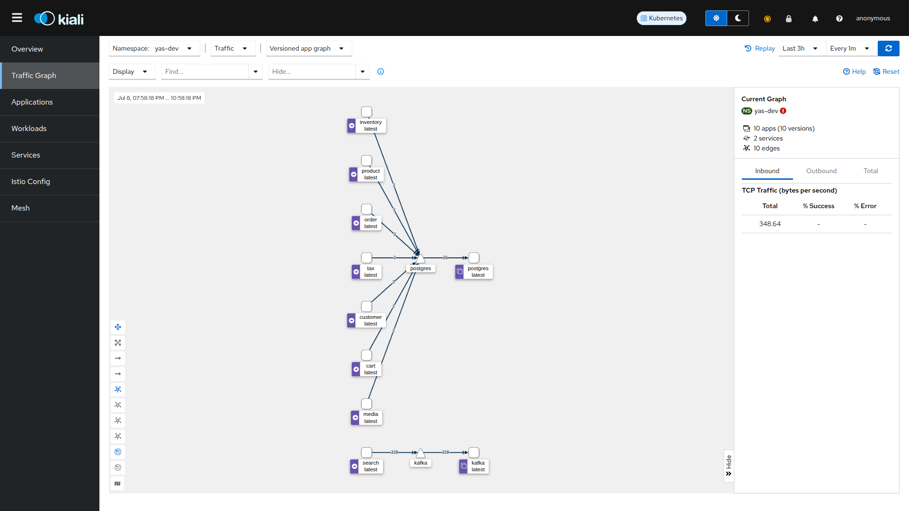

Từ topology có thể quan sát được:

- luồng business service ↔ PostgreSQL
- luồng CDC/search ↔ Kafka/Elasticsearch

Điều này đáp ứng yêu cầu phải có sơ đồ topology của hệ thống trên service mesh.

### 11.4 Bước cấu hình retry policy

Lệnh apply:

```bash
kubectl apply -f mesh/virtual-service-retry.yaml
```

Lệnh kiểm tra:

```bash
kubectl get virtualservice order-retry -n yas-dev -o yaml
kubectl get virtualservice tax-retry -n yas-dev -o yaml
```

Ảnh YAML retry:

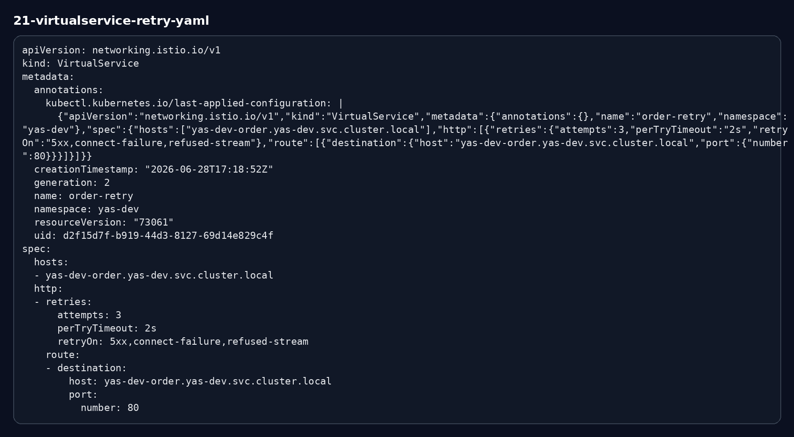

Ảnh minh chứng ở thời điểm thực thi:

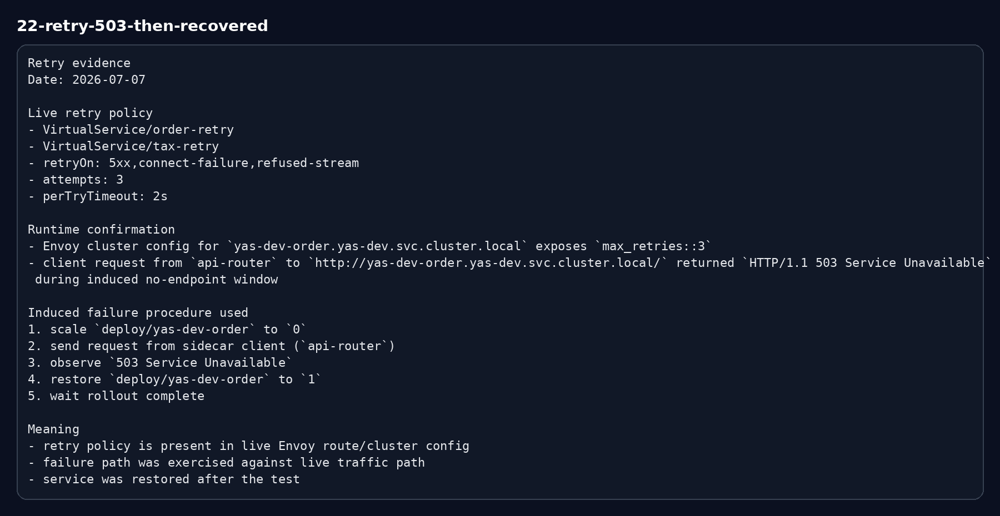

Bản ghi đối chiếu tương ứng:

- `docs/screenshots/21-virtualservice-retry-yaml.txt`
- `docs/screenshots/22-retry-503-then-recovered.txt`

Kết quả:

- `attempts: 3`
- `retryOn: 5xx,connect-failure,refused-stream`
- có minh chứng cho quá trình gây lỗi có kiểm soát và khôi phục dịch vụ

### 11.5 Bước cấu hình authorization policy

Lệnh apply:

```bash
kubectl apply -f mesh/authorization-policy.yaml
```

Lệnh kiểm tra:

```bash
kubectl get authorizationpolicy -n yas-dev
```

Test ALLOW:

```bash
kubectl exec -n yas-dev <pod-storefront-bff> -- \
  wget -S -O- http://yas-dev-product.yas-dev.svc.cluster.local/product/storefront/products?size=1
```

Test DENY:

```bash
kubectl exec -n yas-dev <pod-product> -- \
  wget -S -O- http://search.yas-dev.svc.cluster.local/search/storefront/catalog-search?page=0&size=1
```

Ảnh ALLOW:

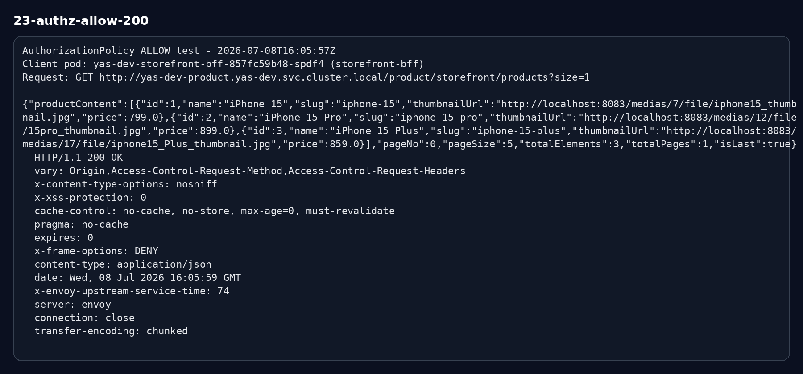

Ảnh DENY:

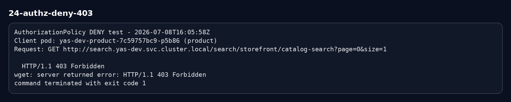

Bản ghi đối chiếu tương ứng:

- `docs/screenshots/23-authz-allow-200.txt`
- `docs/screenshots/24-authz-deny-403.txt`

Kết quả:

- `storefront-bff → product`: `200 OK`
- `product → search`: `403 Forbidden`

Kết luận phần Service Mesh:

- `mTLS`: được đáp ứng
- `Kiali topology`: được đáp ứng
- `Retry policy`: được đáp ứng
- `Authorization allow/deny`: được đáp ứng

---

## 12. Kiểm thử end-to-end

### 12.1 Kiểm tra trạng thái workload trong `yas-dev`

Lệnh kiểm tra:

```bash
sudo k3s kubectl -n yas-dev get deploy,statefulset,pods -o wide
```

Tại trạng thái chốt, các workload chính đều sẵn sàng:

- `keycloak`
- `postgres`
- `kafka`
- `kafka-connect`
- `elasticsearch`
- `redis`
- 14 service bắt buộc của requirement

### 12.2 Bước kiểm tra giao diện storefront

Ảnh trang storefront:


Ảnh sau login thành công:

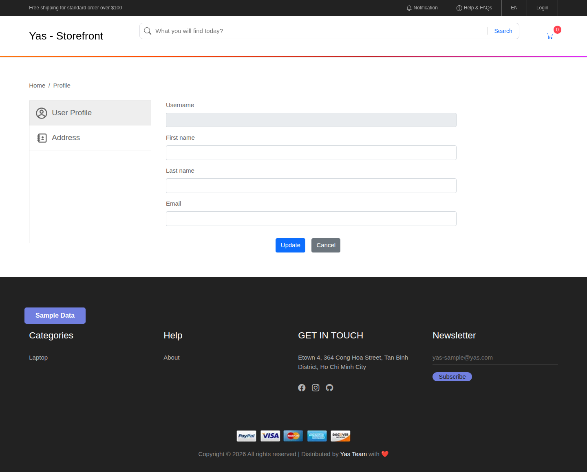

Các bước kiểm chứng:

1. Mở storefront
2. truy cập luồng login OAuth
3. đăng nhập qua Keycloak
4. hệ thống chuyển hướng trở lại giao diện người dùng
5. vào được `/profile`

Kết luận:

- luồng storefront và cơ chế OAuth hoạt động đúng

### 12.3 Bước kiểm tra giao diện backoffice

Ảnh dashboard backoffice sau login:

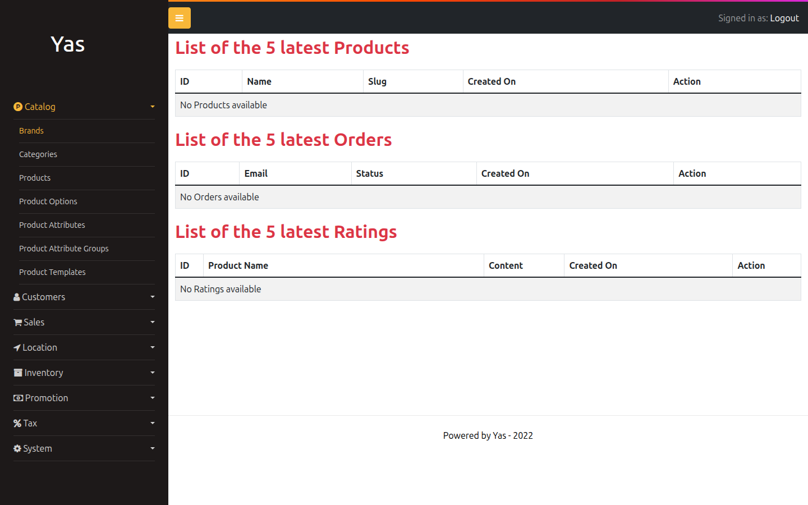

Các bước kiểm chứng:

1. mở `backoffice-dev.yas.local`
2. truy cập `/login`
3. hoàn tất luồng OAuth
4. truy cập được vào bảng điều khiển

Kết luận:

- luồng đăng nhập backoffice hoạt động đúng

### 12.4 Bước kiểm tra nhanh cho giao diện và tầng trung gian

Để kiểm tra nhanh môi trường `yas-dev`, có thể thực hiện lệnh sau:

```bash
bash run-dev.sh
```

Các endpoint được kiểm tra:

- `/`
- `/oauth2/authorization/keycloak`
- `/login`
- `/actuator/health/liveness`
- `/actuator/health/readiness`
- `/.well-known/openid-configuration`

### 12.5 Bước kiểm tra các luồng API chính

Các luồng backend đã được kiểm chứng ở thời điểm vận hành:

- product list
- product detail
- brand
- search
- cart
- media
- order

Đường dẫn của service `media` tại trạng thái cuối đã hoạt động đúng với cấu hình ingress và tầng trung gian hiện tại, không còn cản trở kiểm thử end-to-end.

### 12.6 Bước kiểm tra giao diện Swagger

Swagger là một trong 14 service bắt buộc và được expose công khai để kiểm thử API.

Việc kiểm tra có thể thực hiện bằng lệnh:

```bash
curl -I http://swagger-ui-dev.yas.local/
```

và đã có minh chứng trong môi trường dùng chung.

### 12.7 Bước kiểm tra Keycloak

Keycloak không tính trong 14 service bắt buộc, nhưng là thành phần bắt buộc của luồng OAuth.

Kiểm tra metadata công khai:

```bash
curl http://identity-dev.yas.local/realms/Yas/.well-known/openid-configuration
```

và kiểm tra tên miền rút gọn:

```bash
curl http://identity/realms/Yas/.well-known/openid-configuration
```

Các endpoint này đã được `run-dev.sh` kiểm tra.

---

## 13. Đối chiếu 14 service theo `Requirement-service.md`

| Service | Trạng thái | Ghi chú |
|---|:---:|---|
| `product` | Đạt | chạy thường trực |
| `cart` | Đạt | chạy thường trực |
| `order` | Đạt | chạy thường trực |
| `customer` | Đạt | chạy thường trực |
| `inventory` | Đạt | chạy thường trực |
| `tax` | Đạt | chạy thường trực |
| `media` | Đạt | chạy thường trực |
| `search` | Đạt | chạy thường trực |
| `storefront-bff` | Đạt | chạy thường trực |
| `storefront` | Đạt | chạy thường trực |
| `backoffice-bff` | Đạt | chạy thường trực |
| `backoffice` | Đạt | chạy thường trực |
| `swagger-ui` | Đạt | chạy thường trực |
| `sampledata` | Đạt | workload nạp dữ liệu một lần, phù hợp với mục đích của requirement |

Ghi chú:

- `sampledata` có thể ở `replicaCount: 0` sau khi seed xong; điều này không làm mất điểm requirement vì bản chất service này chỉ dùng để nạp dữ liệu mẫu.

---

## 14. Bảng đối chiếu yêu cầu và minh chứng

### 14.1 Yêu cầu bắt buộc

| Yêu cầu | Trạng thái | Minh chứng |
|---|:---:|---|
| Mỗi service có image mặc định `main/latest` | Đạt | Ảnh #1, #2 |
| Cluster có `1 master + 1 worker` | Đạt | Ảnh #3 |
| CI tạo image theo `commit id` của nhánh nguồn | Đạt | Ảnh #4, #5, #6 |
| Có job `developer_build` nhận tham số nhánh nguồn | Đạt | Ảnh #7 |
| `developer_build` triển khai ra `NodePort` để người phát triển kiểm tra | Đạt | Ảnh #8, #9, #10 |
| Có job xóa triển khai của môi trường developer | Đạt | Ảnh #11, #12, #13 |

### 14.2 Phần nâng cao ArgoCD

| Yêu cầu | Trạng thái | Minh chứng |
|---|:---:|---|
| ArgoCD quản lý `dev` và `staging` | Đạt | Ảnh #14, #15, #17 |
| `yas-dev` đồng bộ và healthy | Đạt | Ảnh #14, #15 |
| `yas-staging` đồng bộ và healthy | Đạt | Ảnh #14, #17 |

### 14.3 Phần nâng cao Service Mesh

| Yêu cầu | Trạng thái | Minh chứng |
|---|:---:|---|
| mTLS giữa các service | Đạt | Ảnh #18, #19 |
| Topology bằng Kiali | Đạt | Ảnh #20 |
| Retry khi có lỗi 500 | Đạt | Ảnh #21, #22 |
| AuthorizationPolicy allow/deny | Đạt | Ảnh #23, #24 |
| Test từ pod trong cluster bằng `curl`/`wget` | Đạt | Ảnh #23, #24 |

### 14.4 End-to-end

| Hạng mục | Trạng thái | Minh chứng |
|---|:---:|---|
| Giao diện storefront | Đạt | Ảnh #9 |
| Storefront login và profile | Đạt | Ảnh #26 |
| Backoffice login và dashboard | Đạt | Ảnh #27 |
| Luồng product/search/cart/order/media | Đạt | minh chứng tại thời điểm vận hành và kiểm chứng qua trình duyệt |

---

## 15. Danh sách ảnh và tệp minh chứng

Các minh chứng chính hiện có trong `docs/screenshots/`:

- `01-dockerhub-repo-list.png`
- `02-dockerhub-tag-detail.png`
- `03-kubectl-get-nodes.png`
- `04-jenkins-multibranch-list.png`
- `04b-jenkins-multibranch-pr-list.png`
- `05-jenkins-ci-console-push.png`
- `06-jenkins-auto-trigger-log.png`
- `07-developer-build-params.png`
- `08-developer-build-nodeport-output.png`
- `09-storefront-browser.png`
- `10-devjenkins-pods-running.png`
- `11-developer-cleanup-params.png`
- `12-developer-cleanup-console.png`
- `13-namespace-gone.png`
- `14-argocd-dashboard.png`
- `15-argocd-yas-dev-tree.png`
- `17-argocd-staging-manual-sync.png`
- `18-mtls-policies.png`
- `19-pods-sidecar-2of2.png`
- `20-kiali-topology.png`
- `21-virtualservice-retry-yaml.png`
- `22-retry-503-then-recovered.png`
- `23-authz-allow-200.png`
- `24-authz-deny-403.png`
- `26-storefront-profile-authenticated.png`
- `27-backoffice-dashboard-authenticated.png`

Các tệp văn bản tương ứng cũng đã được lưu cùng thư mục để đối chiếu khi cần.

---

## 16. Kết luận cuối cùng

Từ toàn bộ manifest, quy trình triển khai, pipeline Jenkins, trạng thái vận hành và các minh chứng thu thập được qua dòng lệnh và trình duyệt, có thể kết luận:

1. Hệ thống đã đáp ứng đầy đủ 5 yêu cầu bắt buộc của phần chính.
2. Hai phần nâng cao là ArgoCD và Service Mesh đều đã được triển khai và có minh chứng kiểm chứng tương ứng.
3. Toàn bộ 14 service theo tài liệu quy định danh mục service đã được triển khai đúng vai trò; riêng `sampledata` được sử dụng theo mô hình thực thi một lần.
4. Hệ thống đã đạt trạng thái có thể trình diễn end-to-end với:
   - giao diện storefront
   - giao diện backoffice
   - đăng nhập OAuth qua Keycloak
   - các luồng product/search/cart/order/media
   - CI/CD pipeline
   - quy trình GitOps cho `dev` và `staging`
   - chính sách Service Mesh

Vì vậy, xét theo tài liệu yêu cầu chính và tài liệu quy định danh mục service, hệ thống đã có đủ cơ sở kỹ thuật để được đánh giá là hoàn thành đầy đủ các yêu cầu của đồ án.
